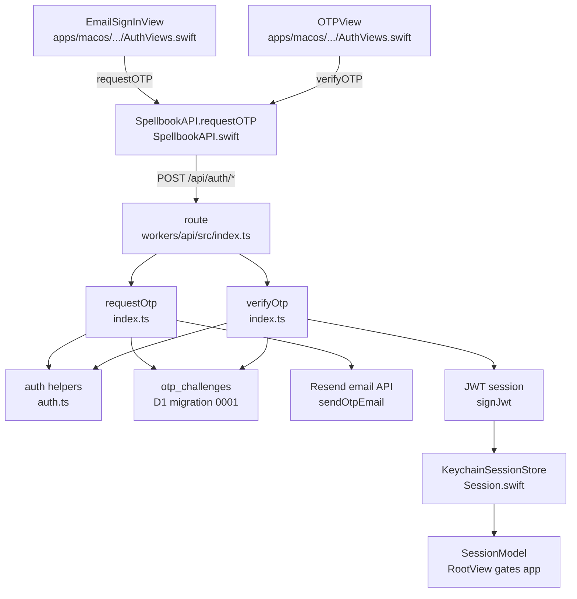

# Authentication and Sessions

## Scope

This page covers the implemented email OTP sign-in path, JWT session format, Worker authentication helpers, and macOS Keychain-backed session state. It does not cover user roles, admin authorization, or web sign-in because those are described only as planned work in `docs/adr/0003-rule-centric-product-model-and-reviewed-sharing.md`, not implemented in the current source.

## Key Artifacts

| Artifact | Role | Evidence |
| --- | --- | --- |
| `workers/api/src/index.ts` | Routes OTP requests and verifies codes. | `route`, `requestOtp`, `verifyOtp`, `deleteExpiredOtpChallenges`, and `sendOtpEmail`. |
| `workers/api/src/auth.ts` | Normalizes emails, generates OTPs, hashes codes, signs JWTs, and verifies bearer tokens. | `normalizeEmail`, `generateOtpCode`, `hashOtp`, `constantTimeEqual`, `signJwt`, `verifyJwt`, `authenticate`, and `authenticateOptional`. |
| `workers/api/src/http.ts` | Produces JSON and CORS responses plus typed application errors. | `AppError`, `json`, `jsonError`, `optionsResponse`, and `readJsonObject`. |
| `workers/api/migrations/0001_initial_schema.sql` | Creates the `otp_challenges` table and indexes used by sign-in. | `CREATE TABLE IF NOT EXISTS otp_challenges`, `idx_otp_email_created`, and `idx_otp_expires`. |
| `workers/api/wrangler.jsonc` | Declares the `DB` D1 binding and public config variables. | `d1_databases`, `SPELLBOOK_WEB_URL`, and `SPELLBOOK_MACOS_DEEPLINK_SCHEME`. |
| `workers/api/.env.example` | Names the required secret-like local environment values. | `SPELLBOOK_JWT_SECRET`, `RESEND_API_KEY`, and `RESEND_FROM_EMAIL`. |
| `apps/macos/Spellbook/Spellbook/AuthViews.swift` | Implements the sign-in UI screens. | `AuthFlowView`, `EmailSignInView`, and `OTPView`. |
| `apps/macos/Spellbook/Spellbook/SpellbookAPI.swift` | Calls the Worker auth endpoints and maps HTTP failures to product errors. | `requestOTP`, `verifyOTP`, and generic `send`. |
| `apps/macos/Spellbook/Spellbook/Session.swift` | Stores, restores, expires, and clears sessions. | `SpellbookSession`, `KeychainSessionStore`, and `SessionModel`. |
| `workers/api/test/auth.test.ts` | Tests helper-level auth behavior. | Email normalization, OTP shape, deterministic OTP hashing, JWT verification, and expired JWT rejection. |

## OTP Request Flow

1. `workers/api/src/index.ts` dispatches `POST /api/auth/request-otp` to `requestOtp`.
2. `requestOtp` requires `RESEND_API_KEY`, `RESEND_FROM_EMAIL`, and `SPELLBOOK_JWT_SECRET` through `requireSecret`; missing values return `503` via `AppError`.
3. The JSON body is read by `readJsonObject`, and `normalizeEmail` trims, lowercases, and validates `body.email`.
4. `generateOtpCode` produces a six-digit numeric code using unbiased random bytes from `crypto.getRandomValues`.
5. `requestOtp` creates a salt with `randomToken`, computes `expiresAt` through `otpExpiresAt`, and hashes `email:code:salt:secret` with `hashOtp`.
6. The Worker inserts the challenge into D1 table `otp_challenges` with `consumed_at` set to `NULL`.
7. `sendOtpEmail` posts the code to `https://api.resend.com/emails` using the configured sender and API key.
8. `ctx.waitUntil(deleteExpiredOtpChallenges(env))` schedules cleanup of expired or consumed challenges after the response path has been started.
9. The client receives `{ ok: true, expiresAt }`.

## OTP Verification Flow

1. `POST /api/auth/verify-otp` dispatches to `verifyOtp`.
2. The Worker validates the email again and requires `body.code` to be exactly six digits.
3. It selects the latest unconsumed challenge for the email from `otp_challenges`, ordered by `created_at DESC`.
4. Missing or expired challenges fail with `400` and the message "The code is invalid or expired."
5. The candidate hash is compared with the stored hash through `constantTimeEqual`.
6. On success, the challenge is marked consumed with `UPDATE otp_challenges SET consumed_at = ? WHERE id = ?`.
7. `signJwt` creates an HS256 JWT with payload fields `email`, `exp`, `iat`, and `iss: "raddus-spellbook"`.
8. The Worker returns `{ token, email, expiresAt }`, where the current helper TTL is 30 days.

## Protected Requests

Protected Worker routes call `authenticate(request, env.SPELLBOOK_JWT_SECRET)`. `authenticate` requires an `Authorization` header starting with `Bearer `, extracts the token, and calls `verifyJwt`. `verifyJwt` checks the token shape, recomputes the HMAC signature, parses the JSON payload, verifies the issuer and expiration, and returns `{ email }`.

Some public-read routes call `authenticateOptional`. It returns `null` when no authorization header is present, but validates the supplied bearer token when one is present. The current registry uses this optional user email to compute `starredByMe` without requiring sign-in for public reads.

## macOS Session Handling

`AuthFlowView` selects between `WelcomeView`, `EmailSignInView`, and `OTPView` based on `SessionModel.authScreen`. `EmailSignInView.sendCode` calls `SpellbookAPI.shared.requestOTP`; success moves the flow to `OTPView(email:)`. `OTPView.verify` calls `SpellbookAPI.shared.verifyOTP`; success passes the returned `SpellbookSession` to `SessionModel.completeSignIn`.

`SessionModel` restores any saved session during initialization. The backing `KeychainSessionStore` serializes `SpellbookSession` through `JSONEncoder.spellbook` and stores it as a generic password with service `com.raddus.spellbook.session` and account `spellbook-jwt`. Expired or unreadable sessions are cleared and return the app to `.welcome`.

`SpellbookAPI.send` treats HTTP `401` as `SpellbookError.expiredSession`. macOS views that catch this error call `sessionModel.clearExpiredSession()`, which clears Keychain state and moves the user back to the sign-in flow.

## Dependencies and Guarantees

The Worker depends on D1 binding `DB`, Web Crypto APIs, and Resend for email delivery. `workers/api/src/http.ts` applies permissive CORS headers to JSON responses and `OPTIONS` requests. The code records safe request IDs for API errors and logs unexpected or server-side failures from `workers/api/src/index.ts`.

Verified tests cover helper-level email normalization, OTP code shape, OTP hashing, JWT signing, JWT verification, and JWT expiration. The tests do not exercise Resend delivery, D1 OTP challenge persistence, macOS Keychain behavior, or end-to-end sign-in through the Swift UI.

## Code map

