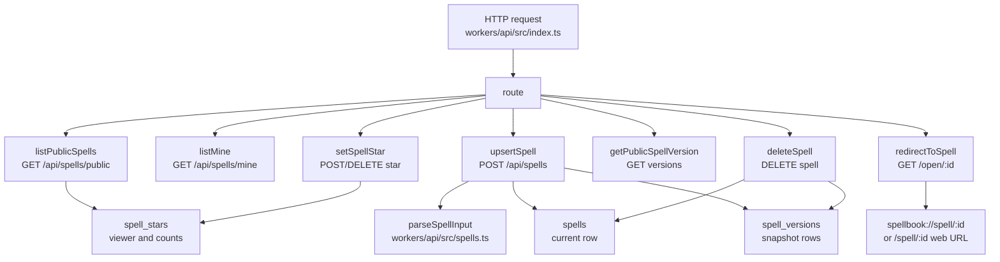

# Backend Spell Registry

## Scope

This page covers the implemented Cloudflare Worker API for public spells: routing, spell input validation, D1 persistence, version snapshots, stars, deletes, dynamic share redirects, and API-level tests. Authentication internals are covered in [Authentication and Sessions](authentication-and-sessions.md). Local installation after a spell is fetched is covered in [macOS Local Instruction Installation](macos-local-instruction-installation.md).

The current backend model publishes spells immediately. It does not yet implement ADR-0003's draft rules, packs, review states, user roles, or admin review queues.

## Key Artifacts

| Artifact | Role | Evidence |
| --- | --- | --- |
| `workers/api/src/index.ts` | Worker entrypoint, route table, D1 mutations, redirects, and error classification. | `fetch`, `route`, `upsertSpell`, `deleteSpell`, `setSpellStar`, `findSpellByUID`, and `findSpellVersionByUID`. |
| `workers/api/src/spells.ts` | Spell input/output normalization. | `parseSpellInput`, `rowToSpell`, `rowsToSpells`, `validatedFile`, and `slugForFile`. |
| `workers/api/src/http.ts` | Response shape, CORS, and JSON request validation. | `json`, `jsonError`, `optionsResponse`, and `AppError`. |
| `workers/api/migrations/*.sql` | D1 schema history for OTPs, spell rows, stars, trigger metadata, versions, and snapshots. | Migrations `0001` through `0006`. |
| `workers/api/test/spells.test.ts` | Tests spell parsing and D1 row response mapping. | Valid markdown-backed input, invalid path cases, required trigger, and `rowToSpell`. |
| `workers/api/test/dynamic-link.test.ts` | Tests `/open/<spell-id>` redirect behavior. | macOS redirect, non-macOS redirect, and iPadOS desktop-class Safari handling. |
| `workers/api/wrangler.jsonc` | Runtime configuration. | Worker name `spellbook-api`, main `src/index.ts`, D1 binding `DB`, and public URL variables. |

## Route Surface

| Method and path | Handler | Auth | Side effect |
| --- | --- | --- | --- |
| `GET /api/health` | inline branch in `route` | none | none |
| `GET /open/<spell-id>` | `redirectToSpell` | none | none |
| `POST /api/auth/request-otp` | `requestOtp` | none | inserts OTP challenge and sends email |
| `POST /api/auth/verify-otp` | `verifyOtp` | OTP code | consumes OTP challenge and returns JWT |
| `GET /api/spells/public` | `listPublicSpells` | optional bearer | none |
| `GET /api/spells/mine` | `listMine` | bearer | none |
| `POST /api/spells` | `upsertSpell` | bearer | inserts or updates spell and inserts version snapshot |
| `POST /api/spells/<uid>/star` | `setSpellStar` | bearer | inserts `spell_stars` row |
| `DELETE /api/spells/<uid>/star` | `setSpellStar` | bearer | deletes `spell_stars` row |
| `GET /api/spells/<uid>/versions/<version>` | `getPublicSpellVersion` | optional bearer | none |
| `GET /api/spells/<uid>` | `getPublicSpell` | optional bearer | none |
| `DELETE /api/spells/<uid>` | `deleteSpell` | bearer | deletes stars, versions, and current spell row |

`route` returns `jsonError("That Spellbook endpoint was not found.", 404)` for unmatched paths.

## Persistence Model

`migrations/0001_initial_schema.sql` creates `otp_challenges` and an older `spells` shape. `migrations/0002_markdown_spell_schema.sql` replaces the old role/category/requirement fields with markdown-oriented `name`, `description`, `file`, `content`, and `tags_json`. `migrations/0003_spell_stars.sql` adds `spell_stars`. `migrations/0004_spell_trigger_metadata.sql` adds `spells.trigger` and backfills it from the `## Trigger` section when possible. `migrations/0005_spell_versions.sql` adds `spells.version`. `migrations/0006_spell_version_snapshots.sql` creates `spell_versions` and seeds it from current spell rows.

At runtime, `upsertSpell` treats `spells` as the current published row and `spell_versions` as version snapshots. Star counts are computed with subqueries against `spell_stars`, not denormalized into `spells`.

## Publishing Flow

`upsertSpell` starts by parsing the JSON body through `parseSpellInput`. Required fields are `name`, `description`, `trigger`, and `content`. The `file` value must be a relative `instructions/<name>.md` path without `..`; if omitted, `parseSpellInput` derives it with `slugForFile(name)`.

When the input has no `uid`, `upsertSpell` creates a new UUID, inserts a current row into `spells` with `version = 1` and `published = 1`, inserts a matching `spell_versions` snapshot, reads the created row back through `findSpellByUID`, and returns it with HTTP `201`.

When the input includes a `uid`, `upsertSpell` reads the current spell through `findSpellByUID`, verifies `existing.owner_email === ownerEmail`, increments the version, updates the current `spells` row, inserts a new `spell_versions` snapshot, reads the updated row, and returns it. Updating a spell therefore publishes a new version immediately rather than creating a private draft.

## Read and Star Flows

`listPublicSpells` reads `published = 1` rows ordered by `updated_at DESC` and limits results through `parseLimit`, capped at 100. If an optional bearer token is present, the viewer email is used to calculate `starred_by_viewer`.

`listMine` returns all spells owned by the authenticated email. `getPublicSpell` and `getPublicSpellVersion` both require the current `spells.published` flag to be `1`; version lookup joins `spells` to `spell_versions` by `spell_id` and exact version number.

`setSpellStar` reads the spell, then either inserts `INSERT OR IGNORE INTO spell_stars` or deletes the viewer's star row. It returns the same spell response shape after reloading current counts. The handler does not check `published = 1` before allowing a star; it only requires that `findSpellByUID` returns a row.

`deleteSpell` requires ownership and deletes dependent `spell_stars` and `spell_versions` rows before deleting from `spells`. The migration also defines a foreign key from `spell_stars` and `spell_versions` to `spells`, but the handler performs explicit deletes.

## Dynamic Share Links

`GET /open/<spell-id>` normalizes and validates the path segment, then calls `requestComesFromMacOS`. User agents matching `Macintosh` or `Mac OS X` and not matching `iPhone`, `iPad`, `iPod`, or `Mobile` redirect to `spellbook://spell/<spell-id>`. Other requests redirect to the configured web app root with pathname `/spell/<spell-id>`.

`workers/api/test/dynamic-link.test.ts` verifies macOS redirect behavior, non-macOS web redirect behavior, and the iPadOS desktop-class Safari exclusion.

## Error Handling

`fetch` wraps `route` in a `try`/`catch`. `AppError` messages are returned directly through `jsonError`; unexpected errors are passed to `classifyUnexpectedError`. D1 schema mismatches, SQLite/D1 failures, missing database configuration, and generic unexpected failures each receive product-safe messages. Server-side failures include a generated `requestId` in the JSON response and console log payload.

## Code map

