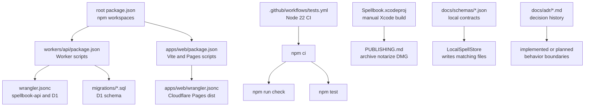

# Development Operations and Contracts

## Scope

This page covers repository-level commands, CI, build/deploy configuration, D1 migrations, macOS release notes, JSON schemas, and ADRs. Runtime behavior is covered in the other domain pages.

## Repository Shape

The root `package.json` declares two npm workspaces: `workers/api` and `apps/web`. The Swift app under `apps/macos/Spellbook` is not an npm workspace; it is an Xcode project.

| Area | Important files |
| --- | --- |
| Root workspace | `package.json`, `package-lock.json`, `.gitignore`, `README.md`, `.github/workflows/tests.yml` |
| Worker API | `workers/api/package.json`, `workers/api/tsconfig.json`, `workers/api/wrangler.jsonc`, `workers/api/migrations/*.sql`, `workers/api/test/*.test.ts` |
| Web app | `apps/web/package.json`, `apps/web/tsconfig.json`, `apps/web/wrangler.jsonc`, `apps/web/index.html`, `apps/web/public/_redirects` |
| macOS app | `apps/macos/Spellbook/Spellbook.xcodeproj/project.pbxproj`, `apps/macos/Spellbook/Spellbook.xcodeproj/xcshareddata/xcschemes/Spellbook.xcscheme`, `apps/macos/Spellbook/PUBLISHING.md` |
| Contracts and decisions | `docs/schemas/*.json`, `docs/adr/*.md`, `docs/adr/0003/*.md` |

The repository also contains generated or local-output paths such as `node_modules`, `.wrangler`, `.build`, `.module-cache`, `.swiftpm`, `apps/web/dist`, and Xcode user data. `.gitignore` excludes those categories, and this wiki treats them as generated noise.

## Supported npm Commands

The root scripts are:

| Command | Effect |
| --- | --- |
| `npm run check` | Runs `npm run check -w workers/api` and `npm run check -w apps/web`. |
| `npm test` | Runs `npm run test -w workers/api`. |
| `npm run dev:api` | Runs the Worker dev server through the API workspace. |
| `npm run dev:web` | Runs the Vite dev server through the web workspace. |
| `npm run build:web` | Runs the web production build. |
| `npm run deploy:web:create` | Creates the Cloudflare Pages project from the web workspace script. |
| `npm run deploy:web` | Builds and deploys the web app to the main branch Pages deployment. |
| `npm run deploy:web:preview` | Builds and deploys a preview Pages deployment. |

`workers/api/package.json` adds `wrangler dev --persist-to ./.wrangler/state --port 8787`, `wrangler deploy --minify`, `wrangler types`, `tsc --noEmit`, `vitest run`, and local/remote D1 migration scripts. `apps/web/package.json` adds Vite dev/build/check scripts plus Pages deploy commands.

## CI

`.github/workflows/tests.yml` defines a `Tests` workflow. It runs on pull requests, merge queue, and manual dispatch. The `all-tests` job uses Ubuntu, checks out the repository, sets up Node.js 22 with npm cache, runs `npm ci`, runs `npm run check`, and runs `npm test`.

The Worker check currently runs `npm run typegen && tsc --noEmit`, which can update `workers/api/worker-configuration.d.ts` when run locally. That file is generated by Wrangler and ignored by `.gitignore`, though it exists in the current working tree.

## Cloudflare API Deployment

`workers/api/wrangler.jsonc` configures the Worker:

| Key | Value or role |
| --- | --- |
| `name` | `spellbook-api` |
| `main` | `src/index.ts` |
| `compatibility_date` | `2026-08-05` |
| `compatibility_flags` | `nodejs_compat` |
| `workers_dev` | `true` |
| `observability` | Logs and traces enabled with sampling. |
| `vars.SPELLBOOK_WEB_URL` | `https://spellbook.raddus.dev/` |
| `vars.SPELLBOOK_MACOS_DEEPLINK_SCHEME` | `spellbook` |
| `d1_databases[0].binding` | `DB` |
| `d1_databases[0].database_name` | `spellbook` |
| `d1_databases[0].migrations_dir` | `migrations` |

`README.md` names the production API as `https://api.spellbook.raddus.dev/`, states that macOS and web clients do not expose an editable API URL, and lists required Worker secrets: `SPELLBOOK_JWT_SECRET`, `RESEND_API_KEY`, and `RESEND_FROM_EMAIL`.

Remote D1 migrations are applied with `wrangler d1 migrations apply spellbook --remote` according to `README.md`; the API workspace also provides `npm run migrate:local` and `npm run migrate:remote`.

## Cloudflare Pages Deployment

`apps/web/wrangler.jsonc` configures the Pages project named `spellbook` with build output `dist`. `README.md` says the public web app deploys to Cloudflare Pages, should have `spellbook.raddus.dev` attached, and can be deployed with the root `deploy:web:create`, `deploy:web`, and `deploy:web:preview` scripts.

The Pages app relies on `apps/web/public/_redirects` to serve `index.html` for `/spell/*`, which preserves direct public spell links on refresh.

## macOS Build and Release

The Xcode scheme `apps/macos/Spellbook/Spellbook.xcodeproj/xcshareddata/xcschemes/Spellbook.xcscheme` builds, runs, profiles, analyzes, and archives the `Spellbook` target. `project.pbxproj` configures:

| Setting | Evidence |
| --- | --- |
| Product name | `Raddus Spellbook` |
| Bundle identifier | `com.raddus.spellbook` |
| Marketing version | `1.0.0` |
| Current project version | `1` |
| macOS deployment target | `13.0` |
| Hardened runtime | `ENABLE_HARDENED_RUNTIME = YES` |
| Entitlements file | `Spellbook/Spellbook.entitlements` |

`apps/macos/Spellbook/PUBLISHING.md` documents a manual Xcode Organizer flow for signing, archiving, notarization, creating a `.dmg`, testing on a clean machine or account, and uploading the release asset to GitHub Releases.

## Schemas and ADRs

`docs/schemas/instruction-version-index.schema.json` defines the current local metadata contract for an installed instruction version. It requires `uid`, `version`, `name`, `description`, and `trigger`, with optional `file`.

`docs/schemas/targets.schema.json` defines durable known targets as `schema_version: 1` plus an array of `root` and `harness_files`, where harness files must be one of `AGENTS.md`, `AGENT.md`, or `CLAUDE.md`.

The ADRs are important context but not all are implemented as current behavior:

| ADR | Status | Relationship to code |
| --- | --- | --- |
| `docs/adr/0001-local-agent-context-instruction-structure.md` | Superseded | Describes an older resolver and `.agent-context` approach. Current code keeps migration compatibility but does not use the resolver as the active harness contract. |
| `docs/adr/0002-inline-spellbook-instructions-in-harness-files.md` | Accepted | Matches the implemented app-written managed block model in `InstructionManager`. |
| `docs/adr/0003-rule-centric-product-model-and-reviewed-sharing.md` | Draft | Plans a future rule/pack/workspace/review model that is not implemented in the current code. |
| `docs/adr/0003/*.md` | Task packet | Splits ADR-0003 future work into backend, web, macOS, docs, and integration tracks. These files are untracked in the starting worktree for this wiki task. |

## Evidence Gaps

The repository has Worker Vitest coverage for auth helpers, spell parsing/response mapping, and dynamic links. It does not contain web tests, Swift unit tests, or an automated macOS build in CI. The operational docs describe production deploy commands and secrets, but the repository does not include automation for notarizing or publishing the macOS release asset.

## Code map

