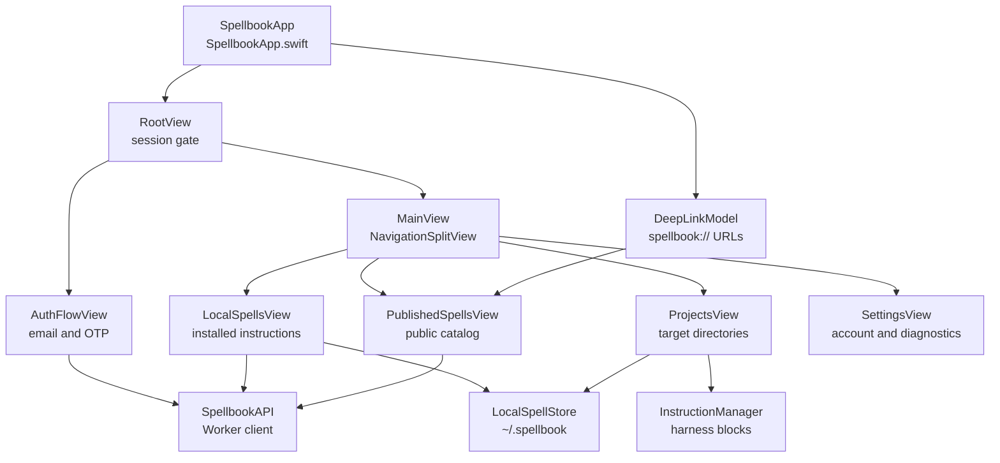

# macOS Application Workflows

## Scope

This page covers the SwiftUI application composition and user-facing workflows: sign-in gating, local instruction management, public spell browsing, project target management, settings, share links, and deep links. Filesystem mutation details are covered in [macOS Local Instruction Installation](macos-local-instruction-installation.md), and Worker endpoint behavior is covered in [Backend Spell Registry](backend-spell-registry.md).

## Key Artifacts

| Artifact | Role | Evidence |
| --- | --- | --- |
| `apps/macos/Spellbook/Spellbook/SpellbookApp.swift` | Application entrypoint and environment object composition. | `SpellbookApp`, `RootView`, `SessionModel`, `LocalSpellStore`, and `DeepLinkModel`. |
| `apps/macos/Spellbook/Spellbook/MainView.swift` | Top-level app navigation. | `SpellbookPage` cases `local`, `projects`, `published`, and `settings`. |
| `apps/macos/Spellbook/Spellbook/AuthViews.swift` | Welcome, email, and OTP sign-in screens. | `AuthFlowView`, `WelcomeView`, `EmailSignInView`, and `OTPView`. |
| `apps/macos/Spellbook/Spellbook/SpellPages.swift` | Main screens, forms, details, project tools, settings, and reusable UI. | `LocalSpellsView`, `PublishedSpellsView`, `ProjectsView`, `SettingsView`, `SpellFormView`, `TargetFormView`, and `TargetInstructionReviewView`. |
| `apps/macos/Spellbook/Spellbook/SpellbookAPI.swift` | Network client for auth, public spells, publishing, deleting, stars, and dynamic links. | `requestOTP`, `verifyOTP`, `publicSpells`, `publicSpell`, `mySpells`, `publish`, `delete`, `setStarred`, and `dynamicSpellLink`. |
| `apps/macos/Spellbook/Spellbook/DeepLinkModel.swift` | Captures app-open URLs for published spell IDs. | `open(_:)` handles `spellbook://spell/<id>` and `spellbook:?spell=<id>`. |
| `apps/macos/Spellbook/Spellbook/Info.plist` | Registers the app URL scheme. | `CFBundleURLTypes` includes `spellbook`. |
| `apps/macos/Spellbook/Spellbook/Spellbook.entitlements` | Declares sandbox, file, and network permissions. | App sandbox, user-selected read/write, home-relative `.spellbook`, and network client. |

## Startup and Navigation

`SpellbookApp` creates three environment objects: `SessionModel`, `LocalSpellStore`, and `DeepLinkModel`. The app window uses `RootView`, forces a light color scheme, sets a minimum frame of `980 x 660`, and passes incoming URLs to `deepLinkModel.open`.

`RootView` gates the app on `sessionModel.session`: unauthenticated users see `AuthFlowView`; authenticated users see `MainView`.

`MainView` renders a `NavigationSplitView` with four implemented pages:

| Page case | Sidebar title | Detail view |
| --- | --- | --- |
| `.published` | Published | `PublishedSpellsView` |
| `.projects` | Projects | `ProjectsView` |
| `.local` | Instructions | `LocalSpellsView` |
| `.settings` | Settings | `SettingsView` |

When `DeepLinkModel.pendingPublishedSpellID` is set, `MainView` switches to `.published`.

## Sign-In Workflow

`AuthFlowView` starts on `WelcomeView`, moves to `EmailSignInView`, then to `OTPView(email:)`. The email screen trims and lowercases input before calling `SpellbookAPI.shared.requestOTP`. The OTP screen stores one digit per field, supports paste of multiple digits through `applyPastedCode`, and calls `SpellbookAPI.shared.verifyOTP`.

On successful verification, `SessionModel.completeSignIn` persists the session through Keychain and exposes it to the rest of the app. Views that catch `SpellbookError.expiredSession` clear the session and send the user back through the auth flow.

## Local Instructions Workflow

`LocalSpellsView` displays `localStore.latestSpells`, which collapses installed versions to the newest version per uid while preserving local-only entries when they exist. On appear and refresh, it calls `localStore.refresh` and then `loadPublishedMetadataForInstalledSpells`.

The plus button opens `SpellFormView(mode: .create)`. Creating requires a signed-in session and immediately calls `SpellbookAPI.shared.publish`; on success, `localStore.updateAfterPublish` installs the returned remote spell locally.

Opening an installed spell shows `SpellFormView(mode: .local(...))`. A user may edit/publish when the spell has no `ownerEmail` or the owner matches `sessionModel.signedInEmail`. The view refreshes live star metadata for installed uid-backed spells by querying public spells and individual public spell lookups.

The star button for installed spells calls `SpellbookAPI.shared.setStarred`, but only when the spell has a uid and the user has a token.

## Published Spells Workflow

`PublishedSpellsView` loads public spells through `SpellbookAPI.shared.publicSpells(token:)`, filters them by `name`, `description`, `trigger`, or `content`, and opens selected spells in `SpellFormView(mode: .published(...))`.

When a deep link arrives, `openPendingPublishedSpellIfAvailable` first searches the loaded list. If the uid is missing, it calls `SpellbookAPI.shared.publicSpell(uid:token:)`, inserts or replaces that spell in local state, and opens it.

Published spell actions include:

| Action | Implementation | Condition |
| --- | --- | --- |
| Install | `localStore.upsertLocal` | Available from published details. |
| Update published spell | `SpellbookAPI.publish` then `localStore.upsertLocal` | Only when `spell.ownerEmail == sessionModel.signedInEmail`. |
| Delete published spell | `SpellbookAPI.delete` | Only for the owner. |
| Star or unstar | `SpellbookAPI.setStarred` | Requires uid and signed-in token. |
| Share | `SpellShareButton` with `SpellbookAPI.dynamicSpellLink` | Requires uid. |

## Project Target Workflow

`ProjectsView` displays `localStore.targets` and persists expanded project IDs through `@AppStorage("spellbook.expandedProjectIDs")`. Each target tile shows the target name, root path plus harness filenames, and the count of installed project spells from `localStore.projectSpells(for:)`.

The add/edit target sheets use `TargetFormView`, which opens an `NSOpenPanel`, lets the user select one or more supported harness files, and calls `localStore.addTarget` or `localStore.updateTarget`.

The review target action opens `TargetInstructionReviewView`. It calls `InstructionManager.preview` to show the target harness path, agent name, managed entry count, local store existence, target registry existence, and the preview content. Apply rewrites managed blocks through `InstructionManager.apply`; remove deletes managed blocks through `InstructionManager.removeManagedBlocks`.

Adding an instruction to a target opens `ProjectInstructionPickerView`, which searches `localStore.latestSpells` and calls `localStore.addToTarget`. Existing project instructions can be removed with `localStore.removeFromTarget`. Updates choose the newest local installed version or a newer public version from `latestRemoteSpellsByUID`; if a remote version has no content in the list response, `installableVersion(for:)` fetches the exact version before installing and writing the harness entry.

## Settings Workflow

`SettingsView` shows the signed-in email and a Sign Out button that calls `sessionModel.signOut`. It displays the real `~/.spellbook` path, optionally displays the sandbox container root if different from the real home path, and exposes "Open in Finder" through `NSWorkspace.shared.open`.

The Repair button calls `localStore.repairSystemStore`, which currently runs the same refresh path and updates the status message. The diagnostics section renders `localStore.diagnostics`, including target and harness problems detected by `scanKnownTargets`.

## Current Vocabulary and Roadmap Boundary

The implemented UI uses "Instructions", "Projects", "Published", and "spells". `docs/adr/0003-rule-centric-product-model-and-reviewed-sharing.md` is a draft plan to rename the product model toward Rules, Packs, Workspaces, and Applies when, but those labels and lifecycle states are not implemented in the current Swift screens.

No macOS test target or Swift unit test files are present. The implemented behavior here is traced from Swift source, entitlements, plist configuration, and project settings.

## Code map

