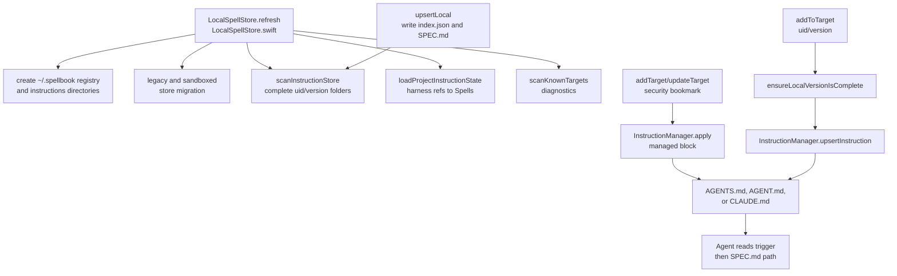

# macOS Local Instruction Installation

## Scope

This page covers the local `~/.spellbook` store, versioned `SPEC.md` files, known target records, managed harness blocks, migration from earlier local layouts, and diagnostics. It focuses on file/state behavior rather than SwiftUI screens; those are covered in [macOS Application Workflows](macos-application-workflows.md).

The repository code writes these local files only when the macOS app runs. This wiki generation did not modify source or user home files.

## Key Artifacts

| Artifact | Role | Evidence |
| --- | --- | --- |
| `apps/macos/Spellbook/Spellbook/InstructionManager.swift` | Defines store paths, harness filenames, managed block parsing/rendering, target apply/remove/update behavior, and legacy target registry reads. | `AgentContextLayout`, `SpellbookUserStoreLayout`, `InstructionManager`, and `HarnessInstructionParseResult`. |
| `apps/macos/Spellbook/Spellbook/LocalSpellStore.swift` | Coordinates local instruction storage, target persistence, scans, target writes, migration, and diagnostics. | `LocalSpellStore`, `SpellbookTarget`, `addTarget`, `upsertLocal`, `addToTarget`, `updateTargetInstruction`, `removeFromTarget`, `scanInstructionStore`, and `scanKnownTargets`. |
| `apps/macos/Spellbook/Spellbook/Spell.swift` | Shared Codable model for local metadata, remote responses, compatibility decoding, target refs, known targets, and diagnostics. | `Spell`, `SpellRegistry`, `TargetInstructionRef`, `KnownTargetsRegistry`, `KnownTarget`, and `SpellbookDiagnostic`. |
| `docs/schemas/instruction-version-index.schema.json` | Contract for local `index.json` metadata. | Required `uid`, `version`, `name`, `description`, and `trigger`. |
| `docs/schemas/targets.schema.json` | Contract for durable known targets. | Required `schema_version` and target entries with `root` plus `harness_files`. |
| `docs/adr/0002-inline-spellbook-instructions-in-harness-files.md` | Accepted design record for app-written managed blocks. | It matches implemented markers and `~/.spellbook/instructions/<uid>/<version>/SPEC.md` paths. |
| `apps/macos/Spellbook/Spellbook/Spellbook.entitlements` | Grants sandbox permissions needed by the local store. | App sandbox, user-selected read/write access, home-relative `/.spellbook/` exception, and network client entitlement. |

## Local Store Layout

`SpellbookUserStoreLayout` resolves the real account home directory with `getpwuid(getuid())` before falling back to Foundation APIs. The implemented store root is:

```text
~/.spellbook/
  registry/
    targets.json
  instructions/
    <uid>/
      <version>/
        index.json
        SPEC.md
```

The app also knows about legacy `~/.spellbook/registry/registry.json`, `~/.spellbook/registry/library.json`, and `~/.spellbook/spells/<storage-id>/<version>/SPEC.md` paths. `sandboxContainerRootURL` detects older sandbox-container-local `.spellbook` roots and lets `LocalSpellStore` migrate uid-backed content into the real home store.

`docs/adr/0003-rule-centric-product-model-and-reviewed-sharing.md` proposes a future `~/.spellbook/rules/<uid>/<version>/SPEC.md` path, but current implementation writes `instructions`, not `rules`.

## Refresh and Scan Flow

`LocalSpellStore.refresh` is the app's central reconciliation method:

1. Create `~/.spellbook/registry` and `~/.spellbook/instructions` if missing.
2. Run `migrateLegacySystemRegistryIfNeeded`.
3. Run `migrateSandboxedSystemStoreIfNeeded`.
4. Write an empty or current `targets.json` with `writeKnownTargets` when the file is absent.
5. Scan complete local instruction versions with `scanInstructionStore`.
6. Load per-target installed refs and matching local `Spell` values with `loadProjectInstructionState`.
7. Scan known targets for warnings with `scanKnownTargets`.
8. Publish `spells`, `projectInstructionRefsByTargetID`, `projectSpellsByTargetID`, `diagnostics`, and `statusMessage`.

`scanInstructionStore` treats a local version as complete only when both `index.json` and `SPEC.md` exist. Incomplete versions produce `SpellbookDiagnostic` warnings with type `incomplete_instruction_version`. Unreadable metadata produces `malformed_instruction_metadata`. Complete versions are sorted by uid/name and version, and missing `Spell.trigger` can be hydrated from the `## Trigger` section in the markdown body.

## Target Enrollment

Targets are represented by `SpellbookTarget`, which stores a root directory path, selected `SpellbookHarness` values, security-scoped bookmark data, and display metadata in `UserDefaults`. The durable cross-process target contract is smaller: `KnownTargetsRegistry` writes `~/.spellbook/registry/targets.json` with `schema_version` and each target's `root` plus selected `harness_files`.

`InstructionManager.supportedFiles` is the complete implemented harness set: `AGENTS.md`, `AGENT.md`, and `CLAUDE.md`. `defaultHarnessFileNames(in:)` selects existing supported files or falls back to `AGENTS.md`.

`LocalSpellStore.addTarget` validates harness names, stores a security-scoped bookmark, calls `InstructionManager.apply` for each selected harness, merges harnesses when a target for the directory already exists, persists target state, and refreshes. `updateTarget` removes managed blocks for deselected harnesses when the directory is unchanged, updates the bookmark and harness list, reapplies managed blocks, persists, and refreshes.

## Managed Harness Blocks

`InstructionManager.apply` creates or updates a Spellbook managed block in each selected harness file. It preserves non-Spellbook file content, creates missing selected harness files by writing the block into an empty file, and removes legacy `.agent-context` packages after applying.

The block is delimited by:

```md
<!-- spellbook:start -->
...
<!-- spellbook:end -->
```

Each instruction entry is delimited by `<!-- spellbook:instruction:start uid="..." version="..." -->` and `<!-- spellbook:instruction:end -->`. `renderInstructionEntry(for:)` writes the trigger text plus `File: ~/.spellbook/instructions/<uid>/<version>/SPEC.md`, using `SpellbookUserStoreLayout.harnessSpecPath`.

`parseManagedBlock(in:)` returns entries and issues. It flags incomplete outer blocks, stray end markers, missing instruction end markers, missing `uid`, and invalid `version`. Mutating methods call `throwIfUnrepairableIssues` before rewriting entries.

## Install, Update, and Remove

`upsertLocal` requires a non-empty `uid`; local-only drafts are rejected with "Publish or sync this instruction before installing it locally." It normalizes the spell identity, preserves known owner metadata when available, writes `index.json` through `writeMetadata(for:)`, writes `SPEC.md` through `writeMarkdown(for:)`, refreshes, and reports the installed `uid@version`.

`addToTarget` requires a uid-backed spell, resolves the target directory, verifies the local version is complete with `ensureLocalVersionIsComplete`, ensures harness blocks exist, and calls `InstructionManager.upsertInstruction` for every selected harness. `upsertInstruction` replaces any existing entry for the same uid while preserving entry order where possible.

`updateTargetInstruction` finds the latest locally installed version for the same uid, verifies the version files, and rewrites entries only in harnesses that currently reference the uid. The Projects UI can also fetch a missing latest remote version through `SpellbookAPI.publicSpell(uid:version:)` before calling `upsertLocal` and `addToTarget`.

`removeFromTarget` deletes one uid entry from each selected harness. It leaves local `~/.spellbook/instructions/<uid>/` files in place. `removeTarget` removes the entire managed block from selected harness files and deletes the target record. `removeLocal` deletes all local versions for a uid only after confirming no known target still references that uid.

## Diagnostics

`scanKnownTargets` emits warnings for stale target paths, target access failures, legacy `.agent-context` packages, missing harness files, missing managed blocks, malformed instruction markers, duplicate uids, managed block mismatches, and missing local `index.json` or `SPEC.md` files for referenced versions. Diagnostics are in-memory app state and are displayed in Settings; they are not persisted to an errors file.

No Swift unit tests for `InstructionManager` or `LocalSpellStore` are present in the repository. The behavior above is traced from implementation and corroborated by ADR-0002 and the local JSON schemas.

## Code map


