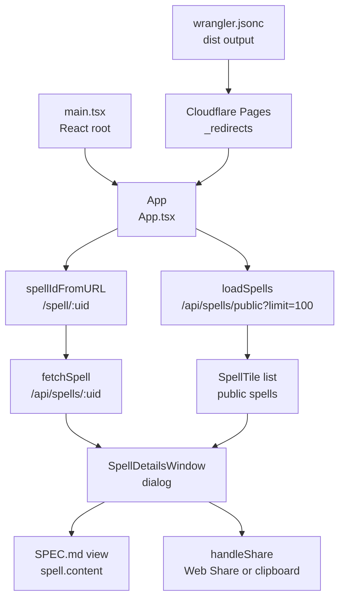

# Web Public Registry

## Scope

This page covers the implemented React/Vite public web app under `apps/web`. The web app is a read-only public catalog for published spells; it does not implement OTP sign-in, publishing, deleting, or starring. Backend behavior is covered in [Backend Spell Registry](backend-spell-registry.md).

## Key Artifacts

| Artifact | Role | Evidence |
| --- | --- | --- |
| `apps/web/src/main.tsx` | React entrypoint. | Renders `<App />` into `#root` with `React.StrictMode`. |
| `apps/web/src/App.tsx` | Entire public app state and UI behavior. | `App`, `SpellTile`, `SpellDetailsWindow`, `StatusPanel`, `fetchSpell`, and URL helpers. |
| `apps/web/src/styles.css` | Responsive layout, cards, modal, status panels, and mobile behavior. | Classes such as `.app-page`, `.spell-list`, `.spell-tile`, `.detail-window`, and `.spec-page-content`. |
| `apps/web/styling.gen.ts` | Generated design tokens and recipes consumed by `App.tsx`. | `designTokens`, `buttonRecipe`, `cardRecipe`, and `overlayRecipe`. |
| `apps/web/public/_redirects` | Cloudflare Pages single-page routing for direct spell links. | `/spell/* /index.html 200`. |
| `apps/web/wrangler.jsonc` | Cloudflare Pages project configuration. | `name: "spellbook"` and `pages_build_output_dir: "dist"`. |
| `apps/web/package.json` | Dev, build, check, and deploy scripts. | `dev`, `build`, `check`, `pages:dev`, `deploy:create`, `deploy`, and `deploy:preview`. |
| `apps/web/public/spellbook-mark.svg` and `apps/web/public/generated/*.png` | Static visual assets. | Used by the web app and present in the public asset tree. |

## Runtime State

`App` stores:

| State | Purpose |
| --- | --- |
| `spells` | Loaded public spell list. |
| `hasLoadedSpells` | Distinguishes initial load from later linked-spell fetches. |
| `isLoadingSpells` | Drives list loading state and `aria-busy`. |
| `error` | Shows registry failure status with retry. |
| `selectedSpellId` | Current `/spell/<uid>` selection, initialized from `spellIdFromURL`. |
| `loadingSpellIds` | Tracks individual linked spell fetches. |
| `missingSpellIds` | Tracks direct links that returned no public spell. |

The app derives `selectedSpell`, `selectedSpellIsMissing`, and `selectedSpellIsLoading` from those state values.

## Public Listing Flow

1. On mount, `App` calls `loadSpells(selectedSpellId)`.
2. `loadSpells` fetches `apiEndpoint("/api/spells/public?limit=100")`, where `apiURL` is hard-coded to `https://api.spellbook.raddus.dev/`.
3. If the list succeeds and the URL contains a selected spell id that is not in the list, `loadSpells` calls `fetchSpell(linkedSpellId)`.
4. `fetchSpell` calls `/api/spells/<uid>`, returns `data.spell` when successful, and returns `null` for non-OK responses.
5. Linked spells found outside the list are prepended to `spells`; missing linked ids are tracked in `missingSpellIds`.
6. Fetch failures show either "Spellbook could not load published spells." for non-OK list responses or "Spellbook could not reach the public registry." for thrown fetch errors.

The web app sends no Authorization header, so public listing and details run as anonymous reads. The response type still includes `starredByMe` because the Worker response shape is shared with authenticated clients.

## URL Selection and Details

`spellIdFromURL` recognizes paths matching `/spell/<uid>`. `openSpell` sets `selectedSpellId` and pushes `/spell/<uid>` through `window.history.pushState`; `closeSpell` clears the selection and pushes `/` when needed. A `popstate` listener keeps app state synchronized with browser navigation, and Escape closes an open details dialog.

`SpellDetailsWindow` renders three states:

| State | Rendering |
| --- | --- |
| Loaded spell | Name, description, trigger, owner email, `SPEC.md` button, and Share button. |
| `isSpecOpen` | Full `spell.content` in a monospace `<pre>`, titled `SPEC.md`. |
| Loading or missing | A compact empty state with "Loading spell" or "Spell not found". |

The details backdrop closes when the user clicks outside the detail window.

## Sharing and Installation CTA

The top navigation includes an install link to the GitHub release asset:

```text
https://github.com/andygruening/raddus-spellbook/releases/download/v1.0.0/Spellbook-1.0.0.dmg
```

`SpellDetailsWindow.handleShare` builds the current web URL through `spellShareURL(uid)`. It prefers `navigator.share` when available, falls back to `navigator.clipboard.writeText`, and finally falls back to a temporary hidden `<textarea>` with `document.execCommand("copy")`.

The Worker dynamic link flow is separate: `/open/<uid>` decides whether to redirect to the macOS URL scheme or to the web `/spell/<uid>` path.

## Styling and Assets

`App.tsx` imports recipes from `styling.gen.ts` and maps them into CSS custom properties in `designStyle`. `styles.css` implements a fixed top header, responsive spell tiles, status panels, modal details, and a mobile bottom-sheet style detail window. Static assets are served from `apps/web/public`; generated PNGs and the SVG mark are first-party assets, while `apps/web/dist` is build output and should be treated as generated.

## Boundaries

The web app currently has no tests in the repository. `apps/web/package.json` provides `npm run check` for TypeScript and `npm run build` for the production Vite build. Cloudflare Pages direct spell links depend on `apps/web/public/_redirects`; without that redirect file, `/spell/<uid>` page refreshes would not reach `index.html` in the Pages deployment.

## Code map


